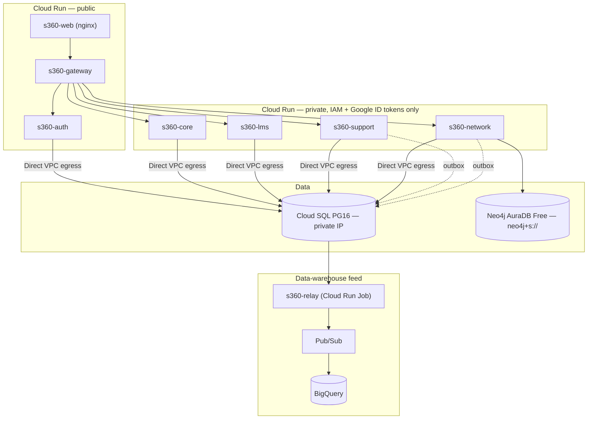

# Stage 2 — deployment on GCP

Stage 1 runs everything locally ([running-locally.md](https://github.com/visionEAE/student360-infra/blob/main/docs/running-locally.md)). Stage 2 puts the same
system on Google Cloud, keyless end to end, with the data-warehouse feed live. This page explains
**how the infrastructure is put together and why** — the two-repository split, the security model
around the database and the graph store, the data-warehouse jobs, and the keyless CI/CD — and then
gives the exact first-deployment sequence.

## 1. Architecture, in one picture

The SPA (nginx on Cloud Run, `s360-web`) talks only to `s360-gateway`. Gateway, auth and web are
public; every other service is **private by IAM** and callable only by the service accounts listed
as its invokers, authenticated with Google-signed ID tokens — the stage-2 adapter behind the same
`ServiceTokenProvider`/`Validator` ports the local HS256 pair used. One Cloud SQL instance holds
every service's schema; Neo4j is **AuraDB Free** (external — GCP has no managed graph database);
domain events flow outbox → relay job (Cloud Scheduler, every 5 minutes) → Pub/Sub
`student360-events` → BigQuery subscription → `student360_dwh.outbox_events`. No custom DNS: the
`*.run.app` URLs, TLS included, are the addresses.



## 2. Terraform: two repositories, split by how recoverable each half is

Infrastructure is split by one question, asked of every resource: *if this were destroyed, would
rebuilding it just be slow, or would something be permanently and unrecoverably lost?*

**[`terraform-backend`](https://github.com/visionEAE/terraform-backend)** holds what would
genuinely be lost — applied rarely, by hand, from a workstation, **never from CI**:

| Module | Owns | Why it is here and not in `terraform-core` |
|---|---|---|
| `tf-state` | The GCS bucket both repositories' state lives in | Versioned, uniform bucket-level access, public access **enforced off**; if this is gone, every other Terraform state is gone with it |
| `artifact-registry` | The Docker repository every image is pushed to | It **is** the rollback history — a cleanup policy keeps the most recent N tagged versions and deletes stale untagged manifests, but never deletes a tagged one |
| `secrets` | Every Secret Manager entry | Database passwords, the JWT signing key, AuraDB credentials — see §3 |
| `github-oidc` | The Workload Identity Federation pool/provider and the deployer service account | The keyless CI identity itself — see §4 |
| `bigquery` | The `student360_dwh` dataset and its `outbox_events` table | Historical analytical data; losing it means losing history, not just redeploying |
| `project-services` | Enabling the GCP APIs everything else needs | Cheap to reapply, grouped here because every other module depends on it |

**[`terraform-core`](https://github.com/visionEAE/terraform-core)** holds everything disposable —
destroyable and rebuildable from zero against the backend's outputs, without losing anything that
matters (the durable state lives one repository over):

| Module | Owns |
|---|---|
| `network` | The VPC, its subnet, and the private-services peering range Cloud SQL uses |
| `cloudsql` | The PostgreSQL instance, its database, and its per-service users — §5 |
| `service-accounts` | One least-privilege runtime identity per workload — §4 |
| `cloud-run-service` | The one reusable module every one of the seven HTTP services instantiates, parameterised |
| `cloud-run-job` | Same shape philosophy, for the relay job |
| `dwh` | The Pub/Sub topic, its BigQuery subscription, the Scheduler that triggers the relay — §7 |

`terraform-core` never re-derives anything the backend already computed: it reads the backend's
state with `data.terraform_remote_state` (same bucket, different prefix) to get the Artifact
Registry path, the WIF provider, and every secret's resource id. Nothing about the backend is
duplicated or copy-pasted between repositories.

**Modularity beyond the split.** Each module takes typed variables and exposes only the outputs
another module needs — `cloud-run-service`, for instance, is instantiated seven times (once per
HTTP service) with a different name, image variable, port, environment map and invoker list each
time, but the underlying resource definition — probes, scaling, secret volumes, the IAM wiring —
is written exactly once. A second environment (`staging`, say) would cost a new entry in
`terraform-core/locals.tf`'s `env_config` map, not a copy of any `.tf` file.

**Deterministic URLs remove the last coordination problem.** Cloud Run v2 names every service a
predictable URL — `https://<service>-<project-number>.<region>.run.app` — computed once as a
Terraform local from `data.google_project`. That is what lets the gateway receive all five
downstream URLs, and each service its own audience, **at creation time**: without it, wiring five
services' URLs into each other would need either a second `terraform apply` pass or a manual
patch step after the first service existed.

**Terraform owns shape, the pipeline owns which build runs.** Every Cloud Run resource declares
`lifecycle { ignore_changes = [template[0].containers[0].image] }`. An unrelated infrastructure
change — bumping memory, adding an env var — can never accidentally roll a service back to the
placeholder image named in `terraform.tfvars`; only the deploy pipeline (§9) ever changes what is
actually running.

## 3. Secrets: two shapes, one rule

`terraform-backend`'s `secrets` module handles every credential in the system as one of two
explicit shapes:

- **Generated** (the five database passwords, the pseudonymisation HMAC key): Terraform mints a
  random value with `random_password` **once**, writes it to Secret Manager, and then
  `lifecycle { ignore_changes = [secret_data] }` on the version — an out-of-band rotation
  (`gcloud secrets versions add`) is never reverted by the next `apply`.
- **Supplied** (the AuraDB URI and password, the JWT private key): Terraform creates the secret
  container but **never writes a version to it**. The value arrives out of band and never touches
  the state file — the trade-off being made explicit here is that *any* value Terraform writes is
  readable in state, which is exactly why the state bucket is versioned, private, and
  access-prevented, and exactly why rotation for anything sensitive always happens outside
  Terraform regardless of which shape it is.

Every secret carries `prevent_destroy`; a runtime service account only ever gets
`secretAccessor` on the **specific secrets it needs** (§4) — never a project-wide secret role, and
never write access to any secret at runtime.

## 4. Keyless CI/CD, end to end

No service-account key exists anywhere in this system — not in a repository, not in a CI variable,
not on disk. The mechanism (`terraform-backend`'s `github-oidc` module):

1. GitHub Actions mints a short-lived **OIDC token** for the running job, asserting claims like
   `repository`, `repository_owner` and `ref`.
2. `google-github-actions/auth@v2` exchanges that token, through a **Workload Identity Pool**, for
   short-lived Google credentials impersonating the deployer service account — no key, no secret,
   nothing to leak or rotate.
3. The exchange is gated by an **`attribute_condition`** — the single most load-bearing expression
   in the infrastructure — that requires **both** `repository_owner == "visionEAE"` **and**
   `repository in [the explicit list of 8 repositories that deploy]`. Pinning only the owner (the
   default suggestion in most tutorials) is not a boundary: any new repository created in the
   organisation would silently inherit deploy rights. The branch (`ref`) is deliberately **not**
   asserted — `main` carries no branch protection in this POC, so a `ref` condition would be
   ceremony, not an actual boundary.
4. The deployer service account itself is **least-privilege, twice over**: it holds
   `artifactregistry.writer` (can push images, cannot delete the registry's rollback history) and,
   per Cloud Run service, `run.developer` + `iam.serviceAccountUser` (can roll out a new revision,
   cannot rewrite that service's IAM policy or its identity).
5. Every value the pipelines consume — project id, region, the WIF provider's resource name, the
   deployer's email, the Artifact Registry path — is written as a plain GitHub Actions **variable**
   by `terraform-backend/scripts/github-setup.sh`. None of it is a credential; leaking a variable
   leaks a hostname, not access.

The same least-privilege discipline extends to every *runtime* identity, not just CI's: the
`service-accounts` module gives each of the seven Cloud Run services its own service account
(Cloud Run's default is the Compute Engine default account, which carries project **Editor** — not
used anywhere here) with a couple of project roles (logging, monitoring) and a `secretAccessor`
grant scoped to the **exact secrets that service reads**, nothing project-wide.

## 5. Database security

**Network isolation first.** `google_sql_database_instance.ipv4_enabled = false` — there is no
public IP, period. Every service reaches Cloud SQL over **Direct VPC egress**
(`PRIVATE_RANGES_ONLY`), a deliberate choice over two alternatives: a Serverless VPC Access
connector (a billed pair of always-on instances) and `ingress = "internal"` on the services
themselves (which would force *all* traffic through the VPC, requiring Cloud NAT — about
$32/month — just so the network-service could still reach AuraDB over the public internet).
Privacy for the four internal services comes from **IAM** (`run.invoker` scoped to specific caller
service accounts — see §8), not from network topology.

**Transport is encrypted and enforced.** `ssl_mode = "ENCRYPTED_ONLY"` on the instance — a
connection that isn't TLS is refused, not merely discouraged.

**One instance, one schema per service, one confined role per schema** — the same isolation model
verified locally by `make check-isolation`, carried into the cloud unchanged. Each service's
database user (password sourced from the `secrets` module) can only reach its own schema; the
`audit` schema is owned by **no** service, and every role's grant on it is `INSERT`/`SELECT` only —
the database engine itself, not application code, is what makes the audit trail append-only. See
`prueba-tecnica.md` §3.2 for the full schema diagram.

**Credentials never round-trip through Terraform state as plaintext application config.** Each
service receives its database password as a **`secret_env`** — a reference to a Secret Manager
version, resolved by the Cloud Run runtime — never as a literal environment variable value in the
service's Terraform definition.

**Capacity is sized for what it actually runs.** `db-f1-micro`'s default `max_connections` (25) is
tiny next to six workloads each bringing their own Hikari pool; the instance sets
`database_flags { name = "max_connections", value = "50" }`, and every service's pool is sized down
(`SPRING_DATASOURCE_HIKARI_MAXIMUMPOOLSIZE=3`, `MINIMUMIDLE=0`) to fit inside that budget instead
of exhausting it on the very first concurrent boot — a real incident this deployment hit and fixed
(the JDBC URL also carries `socketTimeout`/`tcpKeepAlive` so a silently-dropped idle connection
fails fast instead of hanging a pool slot forever).

**Backups and protection.** Daily automated backups (7 retained), `deletion_protection = true`,
and `prevent_destroy` on the instance, its database and — for the CI identity itself — the state
bucket and Artifact Registry: an accidental `terraform destroy` cannot take any of them out.
Point-in-time recovery is deliberately **off** — this is demo data on a trial budget, cheaply
reseedable; the trade-off would flip in a real production deployment.

**One-off human access is bastion-gated, not standing.** A stopped-by-default `e2-micro` (Always
Free tier) with **no external IP**, reached only through **Identity-Aware Proxy** (firewall scoped
to IAP's fixed CIDR, `35.235.240.0/20`) tunnelling to Cloud SQL on a local port. It is started for
a maintenance task and stopped immediately after — it does not sit warm, reachable, and
forgotten between uses.

## 6. Neo4j: why it lives outside GCP, and what stays constant

GCP has no managed graph database, so the support-network's graph store runs on **Neo4j AuraDB
Free**, external to the project. The only thing that differs between the local Docker container
and the cloud deployment is the connection string — `neo4j+s://…` instead of `bolt://localhost` —
because the service talks to it through the exact same port/adapter pair used for every other
storage dependency. `neo4j+s://` is TLS by default, non-negotiable at the protocol level (unlike
Postgres, where `ENCRYPTED_ONLY` had to be set explicitly). Both the URI and the password are
**supplied** secrets (§3): Terraform creates the Secret Manager entries but never writes their
value, so an AuraDB credential is never present in any `.tf` file, any CI variable, or the
Terraform state.

## 7. The data warehouse and its jobs

The DWH feed exists to answer one design constraint from the very first stage: the platform must
work completely — and never lose an event — whether or not anything downstream of it is listening.

**The outbox pattern is what makes that true.** Every state change that matters writes its event
into an `outbox_event` row **inside the same database transaction** as the business change itself
— they commit together or roll back together, so it is structurally impossible for the change to
exist without its event, or the event to exist without the change. Nothing about this changed
between stage 1 and stage 2; only what drains the table did.

**The relay is a Cloud Run *Job*, not a *Service*, on purpose.** It has a start and an end — drain
what is pending, then exit — which is exactly the Cloud Run Job contract, and exactly wrong for a
Service (which expects to keep listening). It runs under its own least-privilege service account,
holding `pubsub.publisher` on the one topic it needs and nothing else. Each run, per schema with an
outbox (`support`, `network`):

```sql
SELECT … WHERE published_at IS NULL ORDER BY created_at LIMIT :batch FOR UPDATE SKIP LOCKED
```

`FOR UPDATE SKIP LOCKED` is what makes **overlapping runs safe**: if a scheduled run is still
draining when the next one fires, the second run simply takes different rows instead of blocking
on the first or double-processing its rows. Each row is published to Pub/Sub and only then marked
`published_at = now()` **in the same transaction** as the publish's confirmation — a crash between
those two steps produces a duplicate on the next run, never a loss, and duplicates are handled
downstream (next paragraph). Delivery is **at-least-once** by design, not by accident.

**Cloud Scheduler triggers the job through its own narrow identity.** A dedicated service account
holds `run.invoker` on **that one job** — nothing else — and Scheduler calls the Cloud Run Admin
API's `jobs:run` endpoint with an OAuth token from that identity every five minutes
(`*/5 * * * *`, one configuration value in `terraform-core/locals.tf`). The same job accepts a
manual, on-demand trigger (`gcloud run jobs execute s360-relay --wait`) for verification without
waiting on the schedule.

**Pub/Sub → BigQuery needs no consumer code at all.** The subscription on topic
`student360-events` is a native **BigQuery subscription** (`bigquery_config`), so Pub/Sub's own
service agent writes each message straight into `student360_dwh.outbox_events` — granted
`bigquery.dataEditor` on the dataset for exactly that purpose. There are deliberately **no
ordering keys**: a BigQuery subscription writes unordered regardless of them, the envelope already
carries its own timestamp, and ordering keys would only cap publish throughput for no benefit.
Message retention is set to 7 days precisely because there is no dead-letter topic yet — a
message BigQuery temporarily rejects keeps being retried instead of vanishing.

**Deduplication happens where the query happens, not where the event is produced.** At-least-once
delivery means a downstream query must assume duplicates are possible; the envelope carries a
stable `eventId`, and every read of `outbox_events` groups or filters by it. This was a deliberate
choice over trying to guarantee exactly-once delivery end to end, which would have added
coordination cost for a property the consumer can restore trivially on its own.

## 8. Cloud Run service security, tying it together

Every one of the seven services shares one `cloud-run-service` module (§2), and its IAM shape is
the same everywhere: `allUsers` is granted `run.invoker` **only** on `gateway`, `auth` and `web` —
the three that must be internet-reachable — and every other service's invoker list is an explicit
set of caller service accounts (`gateway` on all four internal services; `support` and `network`
also on `core`/`lms` where they call synchronously, §5.1 of `prueba-tecnica.md`). Cloud Run
validates the caller's Google-signed ID token at the platform level before a request ever reaches
application code; the application validates it **again** (audience, issuer, an explicit allowed-
caller list) as defense in depth — the same pattern used for the database, the CI identity and
every secret in this document: never one layer where two are cheap to have.

## 9. How a deploy works (every service repo)

Push to `main` (or the always-available manual trigger) → the repo's thin `deploy.yml` calls the
reusable workflow in [`workflows`](https://github.com/visionEAE/workflows), which:

1. Computes a **content hash** over what actually enters the image (sources, pom/lockfile,
   Dockerfile, the exact `student360-common` commit — or the gateway URL, for the SPA) →
   tag `content-<hash>`.
2. If that tag already exists in Artifact Registry, **skips the build** and reuses the digest.
3. Otherwise builds (jar in CI, `provenance: false`) and pushes.
4. Rolls Cloud Run **by digest** — never by tag — and smoke-tests readiness.

A tag identifies *inputs*; a digest identifies *bytes*. A tag can be moved (mutable, so a rollback
can retag a known-good digest for humans reading the registry); a digest cannot, so every revision
names exactly what it runs and a rollback is one command with a digest copied from a previous run's
summary.

## 10. First deployment, in order

```bash
# 0. prerequisites (manual): GCP project + trial billing; gcloud auth login && gcloud auth
#    application-default login; an AuraDB Free instance (note URI + password).

# 1. wire the project id (both repos: backend.tf literal + tfvars), then
cd terraform-backend
scripts/bootstrap.sh                 # local state → targeted apply → migrate → full apply

# 2. supply the out-of-band secrets (values never touch tf state)
gcloud secrets versions add s360-prod-neo4j-uri       --data-file=- <<< "neo4j+s://…"
gcloud secrets versions add s360-prod-neo4j-password  --data-file=- <<< "…"
openssl genpkey -algorithm RSA -pkeyopt rsa_keygen_bits:2048 -out /tmp/jwt-private.pem
gcloud secrets versions add s360-prod-jwt-private-pem --data-file=/tmp/jwt-private.pem

# 3. hand the CI its variables
scripts/github-setup.sh              # gh variable set on the 8 repos; --check reports drift

# 4. the disposable half, phase by phase
cd ../terraform-core
scripts/bootstrap.sh                 # network + Cloud SQL + identities (targeted)
scripts/bastion.sh up
scripts/db-init.sh                   # schemas, audit table, relay grants (idempotent)
scripts/deploy.sh push all           # the six Java images must exist before the probes run
# fill terraform.tfvars with the pushed image refs, then:
terraform apply                      # services with real images; web+relay from the hello image

# 5. real web + relay images (their pipelines fetch the now-live gateway URL)
gh workflow run deploy.yml -R visionEAE/student360-frontend
gh workflow run deploy.yml -R visionEAE/student360-dwh-relay

# 6. seed and verify
NEO4J_URI="neo4j+s://…" NEO4J_PASSWORD="…" scripts/demo/seed-support-network.sh
GATEWAY_URL="$(cd ../terraform-core && terraform output -raw gateway_url)" \
POSTGRES_PORT=15432 scripts/demo/run.sh          # the whole demonstration thread, against the cloud
# after one scheduler cycle (or: gcloud run jobs execute s360-relay --wait):
bq query 'SELECT count(*) FROM student360_dwh.outbox_events'

scripts/bastion.sh down
```

The last proof of the pipeline itself: push a docs-only commit to a service — the deploy skips
via `paths-ignore`; push a code change — the hash gate builds; revert it — the gate finds the
previous content tag already in the registry and **reuses the digest without building**.

## 11. Demo credentials in production

The seeded accounts are the same as local, but their passwords are **not** `student360`: the
production seed hashes values that live only in Secret Manager (fixed, human-typeable — chosen
for demos, not secrecy, and applied at seed time with `pgcrypto`'s `crypt()`/`gen_salt('bf')` so
the stored hash is bcrypt-compatible with the application's own `BCryptPasswordEncoder`). Read them
when you need them; never commit them:

```bash
gcloud secrets versions access latest --secret=s360-prod-seed-student-password   # every STUDENT
gcloud secrets versions access latest --secret=s360-prod-seed-staff-password     # ADVISOR + ADMIN
```

The demonstration scripts take them as environment variables:

```bash
DEMO_PASSWORD="$(gcloud secrets versions access latest --secret=s360-prod-seed-student-password)" \
DEMO_STAFF_PASSWORD="$(gcloud secrets versions access latest --secret=s360-prod-seed-staff-password)" \
GATEWAY_URL=… POSTGRES_PORT=15432 scripts/demo/run.sh
```

## 12. Costs (trial account)

Same picture as [gcp-deployment-feasibility.md](https://github.com/visionEAE/student360-infra/blob/main/docs/gcp-deployment-feasibility.md): Pub/Sub,
BigQuery, Secret Manager and Scheduler sit inside permanent free tiers at demo scale; AuraDB Free
is free; the bastion is a stopped Always-Free `e2-micro`. Cloud Run is **not** scaled fully to
zero: five of the seven services (gateway plus the four internal ones) are kept at one warm
instance each — a fix for a real incident where a cold JVM boot (10–20s, worsened by Direct VPC
egress setup) tripped the gateway's circuit breaker before the request ever finished, producing
intermittent "upstream unavailable" errors under repeated use. The steady costs are that handful of
always-warm instances plus Cloud SQL (`db-f1-micro`, ~$10–15/month) — still comfortably inside the
$300 trial credit for many months of continuous operation.

## 13. Best practices used — a summary

| Concern | Practice applied |
|---|---|
| Credentials | Zero service-account keys anywhere (Workload Identity Federation); zero secrets in Terraform state for anything supplied out of band; every secret access scoped per-secret, never project-wide |
| Blast radius of CI | `attribute_condition` pins organisation **and** an explicit repository allowlist; deployer is writer-not-admin on the registry, developer-not-admin on Cloud Run |
| Identity | One runtime service account per workload, never the project-Editor default; defense in depth (platform-level IAM token check + application-level re-validation) |
| Network | No public IP on the database; Direct VPC egress instead of a billed always-on connector or forced full-VPC egress; IAM (not network topology) is what makes internal services private |
| Data durability | Outbox-before-publish for every domain event; `FOR UPDATE SKIP LOCKED` for safe overlapping jobs; at-least-once delivery with dedup by `eventId`, not a fragile exactly-once guarantee |
| Recoverability | Split by "is this recoverable" (`terraform-backend` vs `terraform-core`); `prevent_destroy` on every genuinely irrecoverable resource; the state bucket itself is versioned |
| Deployment safety | Content-hash build gate (no redundant builds) + digest-based rollout (never a movable tag) + `ignore_changes` so infra applies can't silently roll back a build |
| Least surprise | Deterministic Cloud Run URLs remove an entire class of apply-order coordination bugs |
| Cost discipline | Scale-to-zero everywhere it doesn't fight correctness; the exceptions (warm instances) are named and justified by an incident, not by default |
